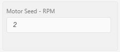
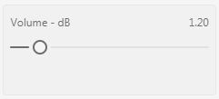
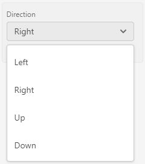

## How to Build
### Development
- Clone repo
- npm install
- `./node_modules/.bin/electron-rebuild` - must be used with python 2 https://github.com/nodejs/node-gyp/issues/193#issuecomment-376602165

## How to Run
- npm start

## CONFIG Format
### Background
During the handshake when connecting to a new device, the micro will send a CONFIG message to MicroManager which contains a JSON string of all settings, state and configuration options (baud, name, etc).

This CONFIG message controls MicroManager, so that MicroManager does not need to have any fore-knowledge of the settings and state on the micro-controller.

### Format
The config message is a JSON encoded string that contains baud, name, settings and state keys. All keys are optional.

#### Example Format
Below is an example of the formatting of a CONFIG message.  See [Settings](#Settings) and [State](#State) for individual setting and state formatting.
```json
{
	"baud": 9600,
	"name": "DeviceName",
	"settings": [
		{
			"n": "SettingName",
			"t": "SettingType",
			"c": 1, // command
			"l": 20, // low (min)
			"h": 30, // high (max)
			"d": 20, // default value
			"r": 22, // cuRrent value
			"f": 0, // float precision
			"i": "SettingUnit"
		},
		...
	],
	"state": [
		{
			"n": "StateName",
			"t": "StateType",
			"c": 7, // command
			"l": 0, // low (min)
			"h": 25, // high (max)
			"u": 250 // update Rate
		},
		...
	]
}
```

#### Abbreviation
To reduce memory overhead on the micro as well as size of the CONFIG message, the JSON keys in "settings" and "state" are abbreviated using the following list (contained in [setting-state-key.js](setting-state-key.js))

- `"n": "name"`
- `"t": "type"`
- `"c": "command"`
- `"l": "min"`
- `"h": "max"`
- `"d": "default"`
- `"u": "updateRate"`
- `"r": "current"`
- `"f": "floatPrecision"`
- `"i": "unit"`
- `"o": "options"`
- `"b": "buttonType"`

## Settings
Settings are settable, configuration variables on the micro. Settings can be displayed in multiple ways in MicroManager and can be integer (signed and unsigned), floating point or string types.

### Integer and Floating Point Types
Integer and floating point types are differentiated with the `float precision` ("f") setting. A float precision of 0 defines an integer while any positive number represents the number of allowable digits after the decimal point
##### Examples
- `"f": 0` = 3
- `"f": 1` = 3.1
- `"f": 2` = 3.14

The bit size and signed-ness of a number is constrained with the `low (min)` ("l") and `high (max)` ("h") settings
##### Examples
- unsigned 8-bit int (uint8_t) - `"f": 0, "l": 0, "h": 255"`
- signed 16-bit int (int16_t) - `"f": 0, "l":-32768, "h":-32768`

_Note: high and low can be further constrained if desired_

### String Types
String types are configured with the [Picker](#picker) type

### Types of Settings
#### Input


Inputs are manual entry type settings. They are used for integer and float type settings only. The high and low settings are checked before updating the value on the micro.

The current setting value is the placeholder text of the input box. Value is updated when the enter key is pressed while the input is focused.

#### Slider


Sliders are adjustable type settings. The handle can be dragged back and forth or the users can click anywhere along the track to update value.

Values are only updated on mouse-up.

The high and low settings define the upper and lower bounds of the track so out of bounds values are not possible.

#### Picker


Pickers are used for string type settings only. All options become available when the drop arrow is clicked. Clicking a setting, updates the value on the micro

## State
States are current values on the micro-controller. They are mostly read-only

### Output
### Processes
### Toggles
### Buttons